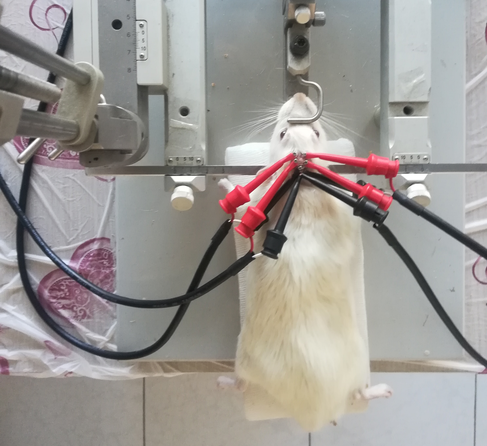
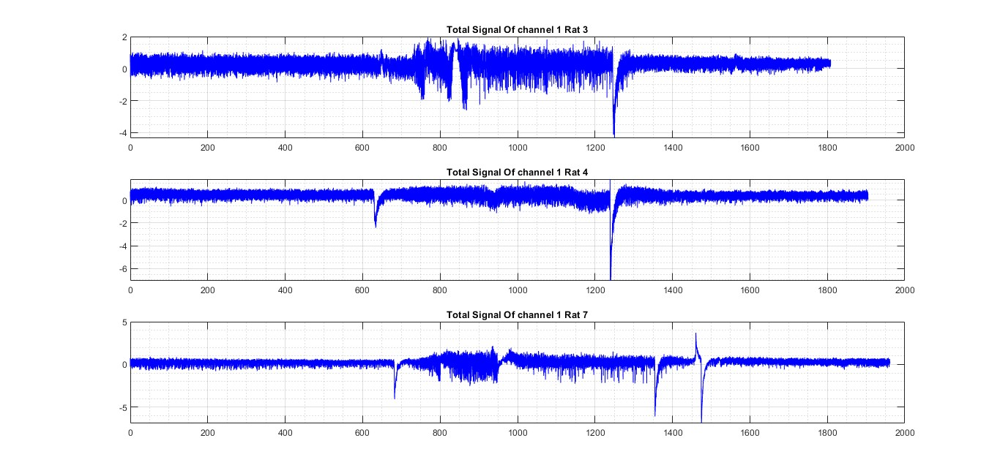
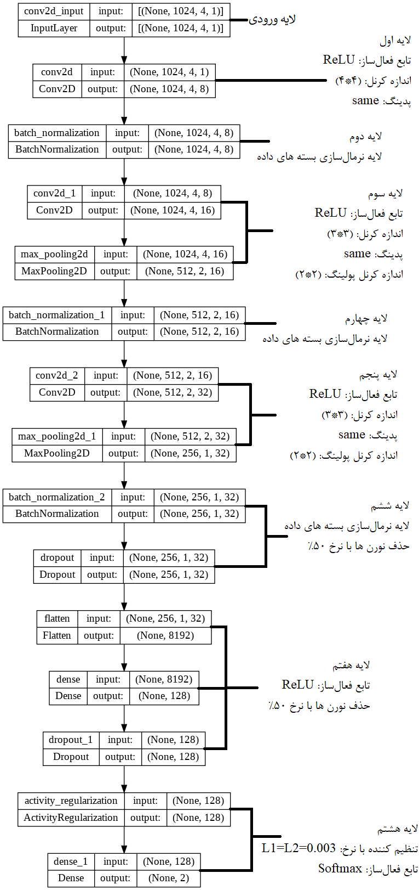
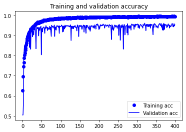
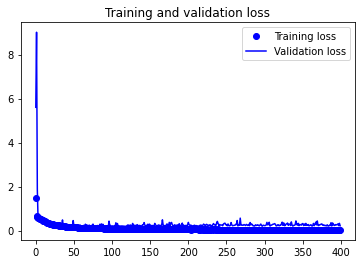
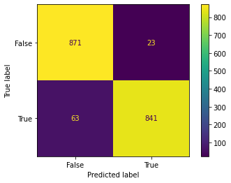

# My_Thesis
 My research on the diagnosis of epilepsy is based on brain signals as a master's thesis.

## Abstract:
According to the World Health Organization, epilepsy is the most common brain disorder
that affects approximately fifty million people worldwide. Epilepsy diagnosis relies on
manual EEG inspection, which is error-prone and time-consuming. Automatic diagnosis
of epileptic seizure from EEG or ECoG signal can reduce diagnosis time and facilitate
treatment targeting for patients. Current detection approaches mainly rely on features that
are manually designed by domain experts. The features are inflexible for recognizing a
variety of complex patterns in large volumes of EEG data. In addition, EEG and ECoG
signals are non-constant, and seizure patterns vary across patients and recording sessions.
EEG and ECoG data always contain many types of noise, which negatively affect the
accuracy of epileptic seizure diagnosis. To address these challenges, deep learning
approaches are reviewed in this paper. The data used in this research were collected from
animal samples (gerbils) and seizures were caused abnormally by drugs. Earth series data
are applied to deep learning networks without any special filter. The only filter used is the
50 Hz notch filter of the utility power. After studying and comparing, convolutional
networks were selected and used to classify the data of this research. The best result was
obtained with 95.22% accuracy and 17.98% error. The designed network produced
promising results for the construction of personalized seizure detectors. Not enough data
was available to increase accuracy and reduce error.

 
 
 
 
 
 

